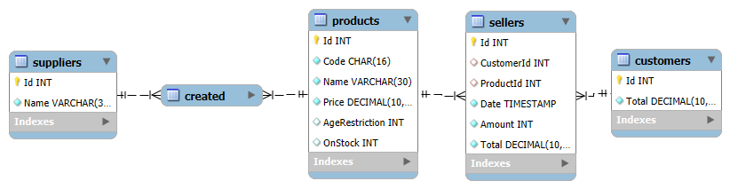

# Simple libary seller manager
It's a sellers manager for a libary made in python and sql. The database was created
by me using my mangas titles and prices as references for the items in the database,
the database has the nexts tables, colums and reations:

I used mysql as **Relational Data Base Managment System** (RDBMS) and mysql workbanch 
to create the **Entity Realitional Diagram** (ERD). the GUI was created with **tkinter** 
which is a python standard libary for GUI, i used entries, labels, and treeViwers,
the program is pretty simple, you hit the product code and amount then press confirm and
it register in a list and insert in the table the product name, amount bought and total,
it also display on right the last product bought.
After give all the products hit the "next" button and then send the payment value and it automatically
show you the change. 

## Project state
It's good and works with no bugs (at least not find yet) already have a GUI for data
visualization, still can't erase products from sellers it's a problem, The schematic is organized
(might need some optmation) and has the necessary data for a libary (data can be add, removed or changed later).
About the code, it's organized with a app class, so i can handler the Libary and Gui variables without
the necessity of use the global scope.

## How to test by yourself?
If you want to see if the program really works fallow the nexts steps:
1. Have the required programs on your pc:
   - Any Relational Data Base Manager System (DBMS) like [MySql](https://www.google.com/url?sa=t&source=web&rct=j&opi=89978449&url=https://www.mysql.com/&ved=2ahUKEwjax4igmNOLAxUyVKQEHRbuDnMQFnoECAsQAQ&usg=AOvVaw20c6IrMAtNC1A9NZPsDpWW) compatible with the `schema.sql` file
   - Python with the libaries on `requirements.txt` installed
2. Download the program source
3. Run `schema.sql` with with your DBMS (You can modfy it to have your own items)
4. Run `main.py`